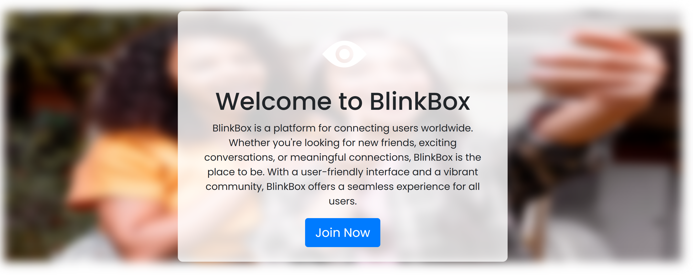
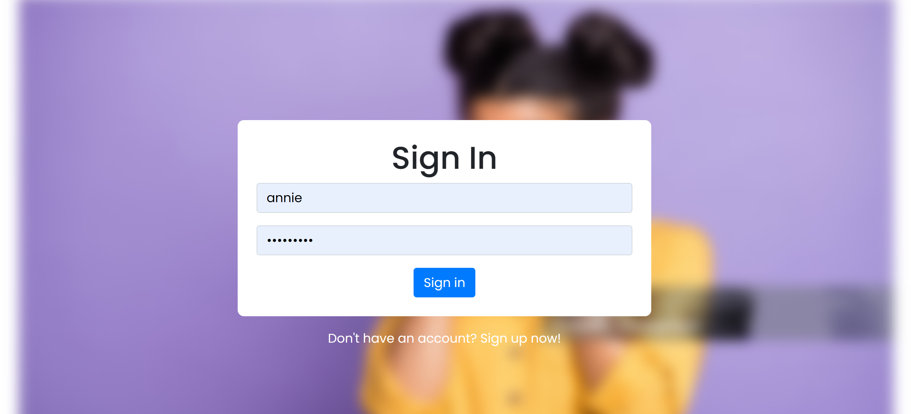
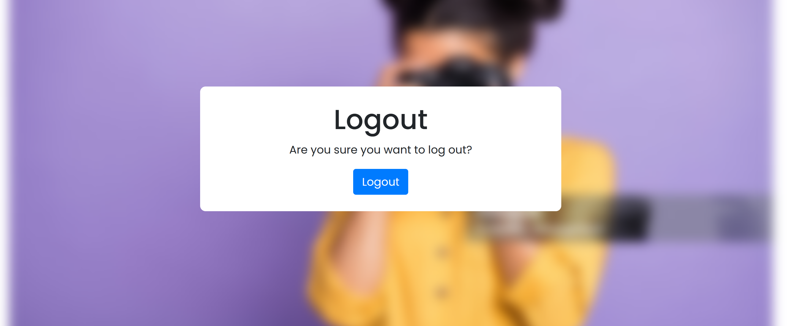
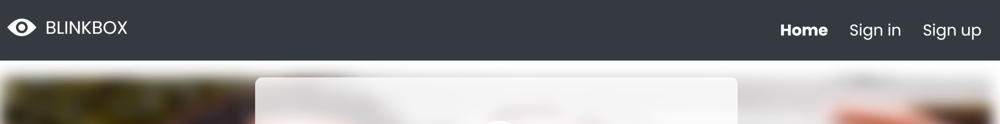
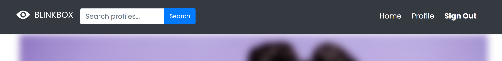
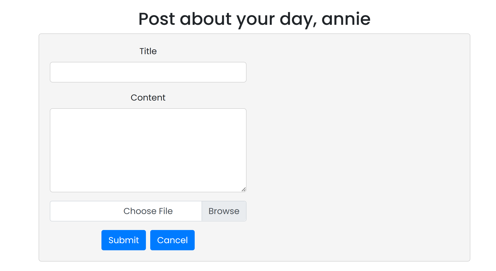

# BlinkBox
Welcome to BlinkBox - a stylish platform for sharing images with friends!

## Table of Contents
Introduction
1. [Existing Features](#existing-features)
     1.   [Welcome Page](#welcome-page)
     2.   [Sign Up & Sign In](#SignUpSignIn)
     3.   [Post Page](#Postpage)
     4.   [Friend Requests](#friend-requests)
     5.   [Homepage Button](#home-page-button)
     6.   [Friend Posts](#friend-posts)
     7.   [Save Posts](#save-posts)
     8.   [Profile Page](#profile-page)
     9.   [Engagement Options](#engagement-options)
3. [Features Left to Implement](#features-left-to-implement)
4. [Getting Started](#getting-started)
5. [Usage](#usage)
6. [Testing](#testing)
   1. [Manual Testing](#manual-testing)
   2. [Validator Testing](#validator-testing)
7. [UX Design](#ux-design)
   1. [Wireframes](#wireframes)
8. [Fixed Bugs](#fixed-bugs)
9. [Deployment](#deployment)
10. [Credits](#credits)
   1. [Content](#content)
   2. [Media](#media)

## Introduction
BlinkBox is a sleek and user-friendly website designed for users to create profiles, share images with friends, and engage with content through likes, loves, and laughs. With its intuitive interface and visually appealing design, BlinkBox makes connecting with friends and sharing memories effortless.

## Features
### Sign Up & Sign In
User Registration: Easily create an account to join the BlinkBox community. Registration requires providing basic information such as username, email, and password.
Log In: Existing users can log in with their credentials for quick access to their profile.

### Homepage Button
Clear Navigation: Prominent buttons for sign-in, sign-up, and homepage navigation ensure ease of use. These buttons are strategically placed at the top of the page for easy access and visibility.
Once logged in, the Navigation buttons change to Home, Profile and Sign Out and a Search bar becomes available so that users can search for their friends to connect!

### Post Page
The Post Page of our platform is designed to facilitate easy sharing of content among users. The central feature of this page is the Post Form, which allows users to create and share posts with other users on the platform.

### Friend Requests
Connect with Friends: Users can send friend requests to other users on the platform. Upon receiving a friend request, users have the option to accept or decline it. This feature facilitates social interaction and networking among users.

### Friend Posts
Stay Updated: Once a friend request is accepted, users can view posts from their friends on their homepage. The homepage displays a feed of posts from friends, allowing users to stay updated on their friends' activities and share moments together.

### Save Posts
Bookmark Favorites: Users have the option to save posts to their profile for easy access later. This feature enables users to bookmark their favorite posts or content they wish to revisit in the future. Saved posts are stored in a designated section within the user's profile.

### Profile Page
Organized Profile: The profile page is designed to provide users with a comprehensive overview of their activity on the platform. It includes separate lists for the user's own posts and saved posts from other users. This organization helps users navigate their profile efficiently and manage their content effectively.

### Engagement Options
Express Yourself: Users can interact with posts shared by other users using various reactions, including like, love, or laugh. These reaction options allow users to express their emotions and engage with content in a meaningful way. Additionally, users can leave comments on posts to initiate conversations and discussions with other users.

## Features Left to Implement

## Getting Started
To get started with BlinkBox:

- Sign up for an account if you're new to BlinkBox. 
- Provide the required information to create your profile and join the community.
- Log in to your account using your credentials.
- If you already have an account, simply enter your username/email and password to access your profile.

## Usage
Once you're signed in, you can:
- Explore the homepage to discover posts from friends.
- Navigate through the feed to view updates from users you're connected with.
- Send friend requests to connect with other users.
- Share your own images and engage with content using reactions.
- Upload your photos, add captions, and share them with your friends.
- Interact with posts shared by others by liking, loving, or laughing at them.
- Save interesting posts to your profile for easy access later.

## Testing
### Manual Testing

## UX Design

## Fixed Bugs

## Deployment

## Credits
### Content

### Media
